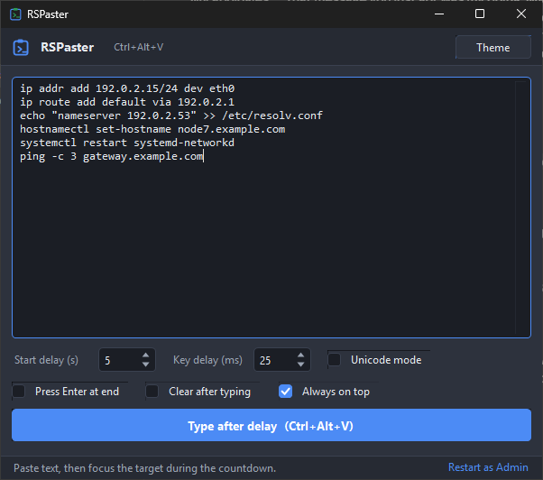

# RSPaster

Types multi-line text into whatever window has focus, as if from a physical
keyboard, for the consoles that will not take a clipboard paste. Built for
hypervisor VM consoles, VNC viewers, IPMI/BMC KVM sessions and UAC prompts,
where reviewing a long command before sending it is most of the work.

No dependencies beyond a stock Windows 10 or 11 install. It uses the .NET
Framework 4.x and the C# compiler that are already on the machine, so there is
nothing to download and no runtime to install.

## Which file do I run?

| File | Job |
|---|---|
| **`RSPaster.exe`** | **The app. Use this one.** |
| `Run-From-Source.cmd` | Runs the same app without the exe, compiling the sources on launch. |
| `Build-RSPaster.cmd` | Not a launcher. Builds `RSPaster.exe` from the sources. |

`Run-From-Source.cmd` and `RSPaster.exe` are not two programs. They are the same
program, either compiled fresh on every launch or compiled once ahead of time.
Identical behaviour, identical features. What differs is the cost:

| | `RSPaster.exe` | `Run-From-Source.cmd` |
|---|---|---|
| Window appears in | 0.7 s | 2.8 s |
| Memory | 38 MB | 95 MB |
| Shows in Task Manager as | `RSPaster` | `powershell` |
| Needs | nothing | the five `.cs` files beside it |
| SmartScreen and antivirus | can flag an unsigned exe | ships no binary |
| Display scaling above 100% | sharp | soft, see below |

Prefer the exe. The source path is there for handing the tool to someone who
will not run an unknown binary, for machines that block unsigned ones, and for
editing a `.cs` file and seeing the change without a build step.

On a display scaled above 100%, use the exe. DPI awareness has to be declared
before a process opens its first window, and the PowerShell host has already
opened one, so the script path lays out at 1x and lets Windows stretch the
result. The proportions stay right but the window is soft. To check the scaled
layout on your own display, run `tools\Dpi-Report.cmd`.

(`Run-From-Source.ps1` does the actual work; the `.cmd` is only a
double-clickable wrapper, because Windows opens a `.ps1` in an editor rather
than running it.)

## Quickstart

If the zip came with `RSPaster.exe`, run it. Nothing to install.

To build the exe yourself, run **`Build-RSPaster.cmd`** once. It finds the
in-box compiler at `%WINDIR%\Microsoft.NET\Framework64\v4.0.30319\csc.exe` and
writes `RSPaster.exe` beside the sources. To skip the binary entirely,
double-click **`Run-From-Source.cmd`**.

**To hand it to someone else:** run `tools\Make-Dist.ps1`. It rebuilds the exe
and writes `dist\RSPaster.zip` holding only what is needed to run or rebuild,
about 70 KB. Unzip it anywhere and run `RSPaster.exe`, or double-click
`Run-From-Source.cmd` to run without the binary at all. Nothing is
installed and nothing is written outside `%APPDATA%\RSPaster`, so uninstalling
is deleting the folder.

Then:

1. Paste your text into the box.
2. Set the **start delay** (time to focus the target) and the **key delay**
   (pause between keystrokes).
3. Either click **Type after delay** and focus the target during the countdown,
   or focus the target first and press **Ctrl+Alt+V**. The hotkey deliberately
   does not pull focus back, so the keys land where you are looking.
4. **Esc**, the hotkey again, or **Cancel** stops it mid-stream.

## Options

| Option | Default | What it does |
|---|---|---|
| Start delay | 3 s | Countdown before typing begins, so you can focus the target. |
| Key delay | 15 ms | Pause between keystrokes. Raise it to 30 - 50 ms if a slow BMC drops characters. |
| Delay between lines | off, 15 s | Waits after each Enter before typing the next line, for machines where a command needs time to finish before the next can be entered. |
| Press Enter at end | off | Appends a newline so the last line is submitted. |
| Clear after typing | off | Wipes the box once typing finishes. |
| Always on top | on | Keeps the window above the console. |
| Unicode mode | off | Sends every character as a Unicode event instead of scancodes. Turn on only if output comes out garbled. |
| Theme | Classic | 30 palettes from the Canvas Suite, grouped Paper / Warm / Cool / Night / Screen. |

The window lives in the tray. Closing it hides it rather than quitting, so the
hotkey keeps working; **Exit** is on the tray icon's right-click menu.

Preferences are kept in `%APPDATA%\RSPaster\settings.ini`, a plain key=value
file you can edit. **The contents of the text box are never written to disk**,
in any form: no settings entry, no recent-items list, no crash backup. It
routinely holds passwords, so it stays in memory only.

## How it works, and where it stops

Keystrokes are injected with the Win32 `SendInput` API. By default each
character is mapped through the *target window's* keyboard layout into a virtual
key plus scancode, which is what VM, IPMI and VNC consoles actually listen for.
Characters that need AltGr, or that are absent from the layout, fall back to a
Unicode event automatically.

**Keystrokes go wherever focus is.** The countdown exists so you can put focus
in the right place. In hypervisor and IPMI viewers, click into the console
screen area first: their surrounding toolbars do not forward keys to the guest.

**Raise the key delay over slow links.** BMC and IPMI KVM consoles drop
keystrokes sent faster than they can process. Missing characters almost always
mean the key delay is too low.

**Key delay and line delay solve different problems.** Key delay is about the
console keeping up with the typing. Line delay is about the *machine* keeping
up with the work: on a slow or busy box, a command has to finish before the
next one can be entered, and without a pause the following line is typed into a
shell that is not ready and is simply lost. Set it to comfortably more than the
slowest command in the list. The status bar counts the wait down, and Esc, the
hotkey and Cancel all stay responsive throughout, so an over-long delay costs
nothing but the time you choose to let run.

**Elevation.** Windows blocks a normal process from sending input to a window
running at higher privilege. If the target is elevated and nothing arrives, use
**Restart as Admin** at the bottom of the window. Typing that completes but
reports blocked keystrokes is this, nearly every time.

**The UAC secure desktop cannot be reached.** It is isolated from all user-mode
input injection, so no tool running in your session can type into it. RSPaster
works with UAC only where prompts are configured to appear on the normal
desktop. Running elevated covers ordinary elevated windows, not the secure
desktop.

## Layout

| Path | Purpose |
|---|---|
| `RSPaster.cs` | Main window, tray icon, hotkey, countdown. |
| `KeySender.cs` | Keystroke injection and every P/Invoke. |
| `Themes.cs` | The palette table, ported from the Canvas Suite. |
| `Controls.cs` | Owner-drawn themed controls and the custom scrollbar. |
| `Settings.cs` | Preference load and save. |
| `Run-From-Source.cmd` / `.ps1` | Run without the exe, compiling on launch. |
| `Build-RSPaster.cmd` | Compile the exe with the in-box compiler. |
| `tools/charcheck.ps1` | Style check: fails on em-dashes and en-dashes. |
| `tools/Make-Dist.ps1` | Builds `dist/RSPaster.zip`, the run-or-rebuild file set. |
| `tools/Dpi-Report.cmd` | Prints the measured layout at the display's real scaling. |
